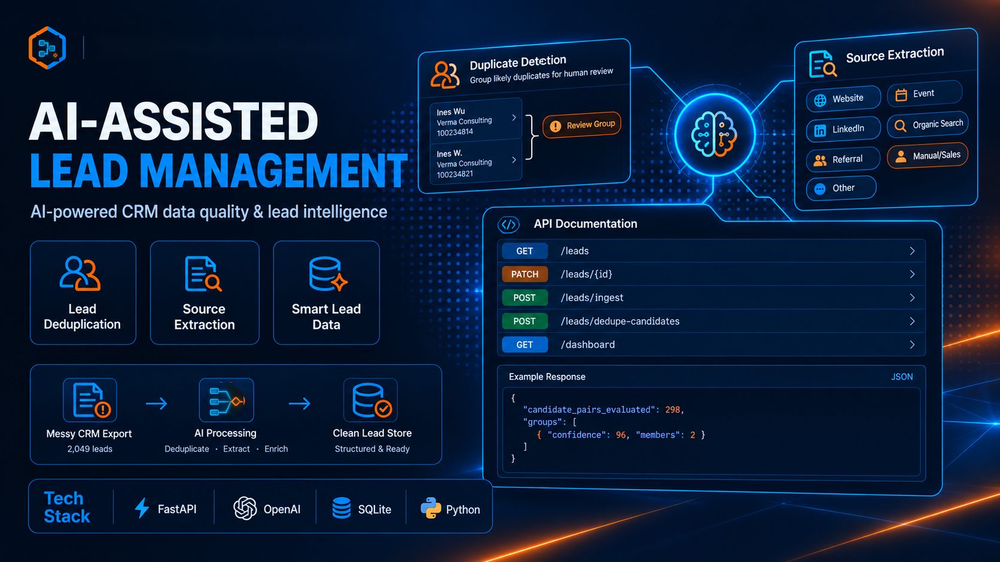

<p align="center">
  
</p>


# AI-Assisted Mini Lead Management System

A FastAPI service on top of a messy CRM export (2,049 leads). It exposes a standard lead store API and adds two AI capabilities: lead deduplication and source extraction from free-text notes.

## How to Run

**Requirements:** Python 3.12 (the version this project was developed and tested on) and an OpenAI API key.

**macOS / Linux:**

```bash
python3 -m venv .venv
source .venv/bin/activate
pip install -r requirements.txt
cp .env.example .env
```

**Windows (PowerShell):**

```powershell
python -m venv .venv
.venv\Scripts\Activate.ps1
pip install -r requirements.txt
Copy-Item .env.example .env
```

**Windows (Command Prompt):**

```bat
python -m venv .venv
.venv\Scripts\activate.bat
pip install -r requirements.txt
copy .env.example .env
```

Then open `.env` in any editor and set `OPENAI_API_KEY`. The key is only needed for `POST /leads/ingest` and `POST /leads/dedupe-candidates` (without it they return a server error), for rebuilding the database, and for the LLM-backed tests. Everything else runs without it.

The repository already includes `leads.db`, a ready database with the 2,049 seed leads and their source extraction filled in, so there is nothing to load. You can go straight to starting the server.

**Optional: rebuild the database from scratch.** Delete `leads.db` first (`rm leads.db` on macOS/Linux, `del leads.db` on Windows), because the loader does not check for existing rows and fails on duplicate primary keys. Then load the seed data. The order matters: the backfill needs the rows created by the loader, and it makes one LLM call per lead (about 2,000 calls), so it is a separate step and not part of server startup. LLM classification is not fully reproducible, so the per-channel counts you get may differ slightly from the ones shown in this README.

```bash
python -m scripts.load_seed_data
python -m scripts.backfill_source_extraction
```

Start the server:

```bash
uvicorn app.main:app --reload
```

Interactive API docs are then available at `http://127.0.0.1:8000/docs`.

| Endpoint | Purpose |
|---|---|
| `GET /leads` | List with filters (`lead_status`, `contact_owner`, `country_region`, `lifecycle_stage`, `original_source`, `source_channel`, `needs_review`, `min_confidence`, `q`) and `limit`/`offset` pagination |
| `GET /leads/{id}` | Lead detail |
| `PATCH /leads/{id}` | Limited update of operational and contact-correction fields |
| `GET /leads/export` | CSV export honoring the same filters as the list endpoint |
| `POST /leads/ingest` | Accept a website form payload (see `data/website_form_submissions.json`), deduplicate, extract source, then store |
| `POST /leads/dedupe-candidates` | On-demand batch duplicate detection, returns groups for human review |
| `GET /dashboard` | Lead counts per status and per source channel |

Configuration is read from environment variables (`.env` is git-ignored). `OPENAI_SOURCE_EXTRACTION_MODEL` and `OPENAI_DEDUP_SCORING_MODEL` are optional overrides for the default models.

### Trying the Endpoints

Keep the server running in one terminal and use a second terminal for the commands below. Two things to know first:

- **`record_id` values are large numbers** such as `100234814`, not 1, 2, 3. Copy one from the list response.
- **`PATCH` and `POST /leads/ingest` write to `leads.db`.** To keep your loaded data intact, make a backup first (server stopped): `cp leads.db leads.backup.db` on macOS/Linux, `copy leads.db leads.backup.db` on Windows. Restoring is copying it back, or running `git restore leads.db` if you cloned the repository. Rebuilding from scratch would mean re-running the backfill, which makes about 2,000 LLM calls. `POST /leads/ingest` and `POST /leads/dedupe-candidates` also call the OpenAI API, so they need a valid `OPENAI_API_KEY` and incur a small cost.

**Option 1, the built-in web UI (any OS, nothing to install).** Open `http://127.0.0.1:8000/docs`, click an endpoint, click **Try it out**, fill in the parameters or the JSON body, click **Execute**, and read the result under **Response body**.

**Option 2, the command line.** The examples below use `curl`, available on macOS, Linux, and Windows 10/11. In Windows PowerShell type `curl.exe` instead of `curl` (plain `curl` is an alias for a different command there). For requests with a JSON body, Windows Command Prompt makes quoting awkward, so use Option 1 or the PowerShell form shown under `PATCH`. Outputs are shortened here, and they were captured from a real run on the seed data.

**1. List leads with filters** (`limit` and `offset` paginate, `q` searches across name, email, and company):

```bash
curl "http://127.0.0.1:8000/leads?lead_status=qualified&source_channel=Website&limit=1"
```

```json
[
  {
    "record_id": 100234814,
    "full_name_computed": "Ines Wu",
    "company_name": "Verma Consulting Trading Co",
    "phone_number": "+351 92 241 9348",
    "lead_status": "qualified",
    "source_channel": "Website",
    "source_confidence": 100,
    "needs_review": false,
    "notes": "Filled out the form on the contact page. Very interested, wants pricing call."
  }
]
```

**2. Get one lead** (same fields as a list item), and what a missing ID returns:

```bash
curl "http://127.0.0.1:8000/leads/100234814"
curl -i "http://127.0.0.1:8000/leads/999999"
```

```
HTTP/1.1 404 Not Found
{"detail":"Lead dengan record_id 999999 tidak ditemukan"}
```

**3. Update a lead** (only `lead_status`, `contact_owner`, `notes`, and the contact fields are accepted):

```bash
curl -X PATCH "http://127.0.0.1:8000/leads/100234814" \
  -H "Content-Type: application/json" \
  -d '{"lead_status": "contacted", "notes": "Called, asked for a demo."}'
```

The same request in Windows PowerShell:

```powershell
Invoke-RestMethod -Method Patch -Uri "http://127.0.0.1:8000/leads/100234814" `
  -ContentType "application/json" `
  -Body '{"lead_status": "contacted", "notes": "Called, asked for a demo."}'
```

The response is the full updated lead: `lead_status` is now `contacted`, `notes` is replaced by the new text, and `last_modified_date` is refreshed. Sending a status that is not one of the 7 valid values, for example `{"lead_status": "not_a_status"}`, is rejected with `422` and a message listing the allowed values: `new`, `contacted`, `qualified`, `opportunity`, `connected`, `closed won`, `closed lost`.

**4. Ingest a form submission.** Use the same phone number as the lead above, so the system recognizes the same person (payload shape follows `data/website_form_submissions.json`):

```bash
curl -X POST "http://127.0.0.1:8000/leads/ingest" \
  -H "Content-Type: application/json" \
  -d '{"form_id": "form_demo_request", "form_name": "Demo Request", "page_url": "/pricing", "submitted_at": "2026-06-12T18:17:00Z", "name": "Ines Wu", "email": "ines.wu@gmail.com", "phone": "+351 92 241 9348", "company": "Verma Consulting", "country": "Portugal", "message": "Interested in a demo after seeing your booth at the trade show."}'
```

```json
{
  "action": "enrich_existing",
  "lead": {
    "record_id": 100234814,
    "lead_status": "contacted",
    "notes": "Called, asked for a demo.\n[2026-09-20T04:49:02+00:00] Interested in a demo after seeing your booth at the trade show.",
    "ingest_page_url": "/pricing"
  }
}
```

The response is `200` with `action` set to `enrich_existing`: no new row was created, `lead_status` was left alone, and the message was appended to `notes` with a timestamp. Now send a person that does not exist yet:

```bash
curl -X POST "http://127.0.0.1:8000/leads/ingest" \
  -H "Content-Type: application/json" \
  -d '{"form_id": "form_contact", "form_name": "Contact Us", "page_url": "/contact", "submitted_at": "2026-06-13T09:00:00Z", "name": "Zara Okonkwo", "email": "zara@brandnewco.example", "phone": "+234 803 555 0101", "company": "BrandNew Co", "country": "Nigeria", "message": "Found you through a LinkedIn post."}'
```

```json
{
  "action": "insert_new",
  "lead": {
    "record_id": 100236860,
    "needs_review": false,
    "source_channel": "LinkedIn",
    "source_confidence": 99
  }
}
```

The response is `201`, a new row was created, and the LLM classified the source channel from the message. An ambiguous match (similar name or email but a different phone) would also return `insert_new`, with `needs_review` set to `true`.

**5. Export to CSV** (accepts the same filters as the list endpoint):

```bash
curl "http://127.0.0.1:8000/leads/export?lead_status=qualified" -o qualified_leads.csv
```

Open `qualified_leads.csv` in Excel, Numbers, or any spreadsheet app. The first row is the column header (`record_id,first_name,last_name,full_name,...`).

**6. Find duplicate candidates** (no request body):

```bash
curl -X POST "http://127.0.0.1:8000/leads/dedupe-candidates"
```

This makes one LLM call per candidate pair. On the seed data, blocking narrows the roughly two million possible pairs down to 298, so expect a wait of a while and a small API cost. The response has `candidate_pairs_evaluated` (how many pairs were scored) and `groups`. Each group lists its `members` (full lead records), an overall `confidence`, and the `pairs` behind it with the LLM's `reasoning` for each. Nothing is merged. If an LLM call fails, the endpoint returns `502` with the reason.

**7. Dashboard:**

```bash
curl "http://127.0.0.1:8000/dashboard"
```

```json
{
  "total_leads": 2049,
  "by_status": {"qualified": 321, "closed lost": 316, "connected": 293, "opportunity": 291, "contacted": 282, "closed won": 276, "new": 270},
  "by_channel": {"Website": 570, "Event": 374, "Organic Search": 311, "Manual/Sales": 263, "LinkedIn": 253, "Referral": 241, "Other": 37}
}
```

These are the counts in the included database. After you ingest a new lead, the totals go up accordingly.

## Design Decisions

### Storage and Stack

- **SQLite (file-based) via SQLAlchemy.** Data survives restarts, which matters because testing this system means restarting it often. It needs no separate server process, and 2,049 rows (growing by tens through ingest) is far below where SQLite struggles. PostgreSQL would add setup friction for strengths (high concurrent writes) that this scope does not need. An in-memory store was rejected because it loses data on every restart.
- **SQLAlchemy over raw SQL.** Mainly for parameter binding on dynamic filters that come from external input, and for readable query composition.
- **FastAPI and Pydantic.** Request validation returns `422` automatically, missing resources return `404` with a clear message, and the same schema layer keeps the API contract explicit.
- **Dashboard uses a plain `GROUP BY` at request time.** At this scale it runs in milliseconds, so a cache would only add invalidation logic.

### Data Modeling

- Raw values are stored as they arrived, and derived values live in separate columns so provenance stays visible: `full_name` (original) vs `full_name_computed` (derived), and `original_source` (CRM) vs `source_channel` (AI).
- Names are not split or merged automatically. The data contains initial-plus-surname patterns that would lose meaning if forced into first/last fields.
- `lead_status` is normalized with `strip().lower()`, which collapses 35 raw spellings into exactly 7 canonical values. `PATCH` rejects anything outside those 7.
- Dates come in three formats (ISO date, `M/D/YYYY`, ISO 8601 with time) and are all normalized. `create_date` is immutable after insert.
- Five columns that are 100% empty in the source are not part of the schema.
- **Enrich, don't overwrite** on ingest: when a submission matches an existing lead, `lead_status`, `contact_owner` and `create_date` are never touched, `notes` are appended with a timestamp, and empty fields are filled in. `PATCH /leads/{id}` is different on purpose: a manual edit by a salesperson overwrites `notes` fully.

### Lead Deduplication

Two mechanisms with different time budgets, deliberately kept separate.

**Ingest path (synchronous, no LLM).** The caller is waiting, and an LLM call would add seconds. Matching is a cascade that stops at the first strong hit:
1. Exact match on normalized phone (digits only). Treated as the same person, so the existing lead is enriched.
2. Same email domain and a similar local part (rapidfuzz). Ambiguous.
3. Similar name. Ambiguous.

Ambiguous cases are stored as a new row with `needs_review=true` instead of being merged, because a wrong merge silently mixes two people's data.

**Batch path (`POST /leads/dedupe-candidates`, LLM-assisted).**
1. **Blocking.** Comparing every pair would be roughly two million comparisons. Candidates are instead the union of two cheap signals (same normalized phone, same email domain with similar local part). A single signal alone was either too broad (domain only lumps together colleagues at one company) or missed pairs the other signal catches.
2. **LLM scoring** of each candidate pair. Similar company names do not mean the same person, and very different name spellings can still be the same person. Both cases are hard for string similarity, which is why the LLM is used here and not on the ingest path.
3. **Graph clustering** with `networkx` connected components, so A~B and B~C yields one group of three even if A and C were never compared directly.

There is **no auto-merge anywhere**. The batch endpoint only returns groups, with per-pair confidence and reasoning, for a human to review.

### Source Extraction

- **LLM only, no keyword rules.** People describe the same channel in unbounded ways, so a keyword list is never complete and needs constant upkeep. A rules-first hybrid was rejected as well, because the form metadata that could drive the rules is inconsistent in the data.
- **Fixed 7 channels** (including a catch-all `Other`) so results can be aggregated on the dashboard. Each result also has a `detail` and a `confidence` from 0 to 100.
- `Other` is a valid answer when the note gives no origin information, and `detail` must still explain why. It is not treated as a failure.
- `confidence` is the model's own estimate (see Known Limitations).
- Runs synchronously inside ingest (each record is independent, so there is no latency-versus-comparison problem), and as a one-time backfill script for the initial 2,049 rows.

**Structured output.** Both AI features use Pydantic schemas passed as constrained decoding at the API level, not a "please answer in JSON" instruction and not parse-then-retry. The channel is an enum, so the model cannot emit a value outside the 7 categories.

### LLM Provider Choice

I compared OpenAI and Anthropic head to head on cost, quality and tooling familiarity, and chose **OpenAI** for both features: a lighter model for source extraction (classification into fixed categories) and a mid-tier model for pair scoring (needs more reasoning). Defaults are set in `app/llm/client.py` and overridable through environment variables.

Summary of the comparison, as of the time of writing (September 2026):

| | OpenAI | Claude |
|---|---|---|
| Light tier, price per 1M tokens (input / output) | about $0.10 / $0.60 | about $1 / $5 |
| Mid tier, price per 1M tokens (input / output) | about $1 / $6 | about $2 / $10 |

Independent benchmarks available at the time also favored the OpenAI light tier on general intelligence, time to first token and context window. At this project's scale (about two thousand short classification calls plus a few hundred pair evaluations), the absolute cost is small with either provider, and I found no evidence that either provider is better for these two tasks specifically (fixed-category classification and pairwise similarity).

**Disclaimer:** model names and prices change quickly. The figures above describe the market when this was written and will likely be out of date when you read them. The evaluation approach (cost, quality, familiarity, decided on data) is the part meant to last, and switching provider only requires changing `app/llm/`.

## Known Limitations

- **Blocking cannot guarantee that every duplicate is found.** Two leads that share no blocking signal (the same normalized phone, or the same email domain with a similar local part) are never compared, so a real duplicate can be missed. Blocking is a large recall improvement over brute force, not a guarantee.
- **The ingest path has no contextual reasoning.** It relies on rules and text similarity only, so two very different spellings of the same person's name are not caught at ingest. Such a pair can only surface later through the batch endpoint.
- **Edits do not re-trigger duplicate detection.** Changing a phone or email through `PATCH` does not re-run the check. A duplicate created that way appears only the next time `POST /leads/dedupe-candidates` is run.
- **Similarity thresholds are starting points.** The rapidfuzz thresholds on the ingest path and the confidence threshold used for clustering come from patterns observed in this dataset and are not calibrated against labeled duplicates.
- **Extraction depends entirely on what the note says.** If a note gives no clue about the origin, the lead becomes `Other`, even when its real origin was simply never written down.
- **Extraction `confidence` is self-reported.** It is the model's own estimate and is not validated against ground truth, so the model can be overconfident or underconfident without the system noticing.
- **Ambiguous notes can receive different channels.** When a note does not clearly name a source (for example "Saw our post about replacing hubspot and commented."), identical text can be classified differently, even within one backfill run. In the run for this repository, 9 distinct note texts received more than one channel, affecting 102 of 2,049 rows, and re-running the backfill can shift the per-channel counts. LLM output is not strictly reproducible.
- **LLM failures are reported, not recovered from.** A failed call surfaces as a clear error (`502` on the batch endpoint) with no retry or circuit breaker.
- **No learning from corrections.** Human decisions on duplicate groups or channels are not fed back into the system.
- **Sized for this dataset.** SQLite, no query tuning, and no handling of high concurrent request volume, so it is not designed for heavy concurrent ingest.

## What I'd Do Next

Deliberately out of scope for this take-home:

- **Scheduled dedupe runs.** Run `dedupe-candidates` on a schedule, and re-check after `PATCH` changes a phone or email.
- **Smarter contact owner assignment.** New ingested leads do not get an owner chosen by workload or territory.
- **Frontend or dashboard UI.** Only the JSON `GET /dashboard` exists.
- **Recalibrating thresholds.** Tune the rapidfuzz thresholds and the clustering confidence threshold against labeled duplicates and more data.
- **Measuring extraction accuracy.** Score channel classification against a labeled sample, and use it to check whether the self-reported confidence can be trusted.
- **Resilience for LLM calls.** Add retries and a circuit breaker around LLM calls.
- **Learning from reviewer corrections.** Feed human decisions on duplicate groups and channels back into the system.

## Testing

```bash
pytest
```

There are 15 tests across 5 files: `test_leads.py`, `test_ingest_dedup.py`, `test_dedupe_candidates.py`, `test_source_extraction.py`, `test_dashboard.py`.

- Tests that write data use a temporary SQLite database, so the real `leads.db` is never touched.
- Tests that would call the LLM either mock the call (`test_ingest_dedup.py`, part of `test_dedupe_candidates.py`) or are skipped when `OPENAI_API_KEY` is not set (`test_source_extraction.py`, and the two LLM-backed dedupe tests).
- The tests are organized around the design claims above: invalid `lead_status` is rejected, a missing lead returns `404`, an exact phone match enriches instead of inserting, an ambiguous match is flagged for review, clearly different people are not flagged, same-company different-person leads are not grouped, and chains of matches form one group.
- Assertions on LLM output check structure and clearly-answerable cases. LLM output is not fully deterministic, so tests avoid genuinely ambiguous inputs.

## Tech Stack

Direct dependencies are pinned to exact versions in `requirements.txt`.

| Area | Choice | Used for |
|---|---|---|
| Language | Python 3.12 | The whole project |
| Web framework | FastAPI 0.141.1, served by Uvicorn 0.53.0 | REST API and interactive docs at `/docs` |
| Validation | Pydantic 2.13.5 (installed with FastAPI) | Request and response schemas, and the structured output schemas for the LLM |
| Database | SQLite through SQLAlchemy 2.0.54 | Lead storage and all queries |
| LLM | OpenAI Python SDK 3.15.0 | Source extraction (default model `gpt-5.6-luna`) and duplicate pair scoring (default model `gpt-5.6-terra`), see LLM Provider Choice |
| Fuzzy matching | rapidfuzz 3.14.6 | Name and email similarity on the ingest path and in blocking |
| Graph | networkx 3.6.1 | Connected components for duplicate clustering |
| Configuration | python-dotenv 1.2.3 | Loading `OPENAI_API_KEY` and model overrides from `.env` |
| Testing | pytest 9.1.1, httpx 0.28.1 | Test runner, and the HTTP client behind FastAPI's `TestClient` |
